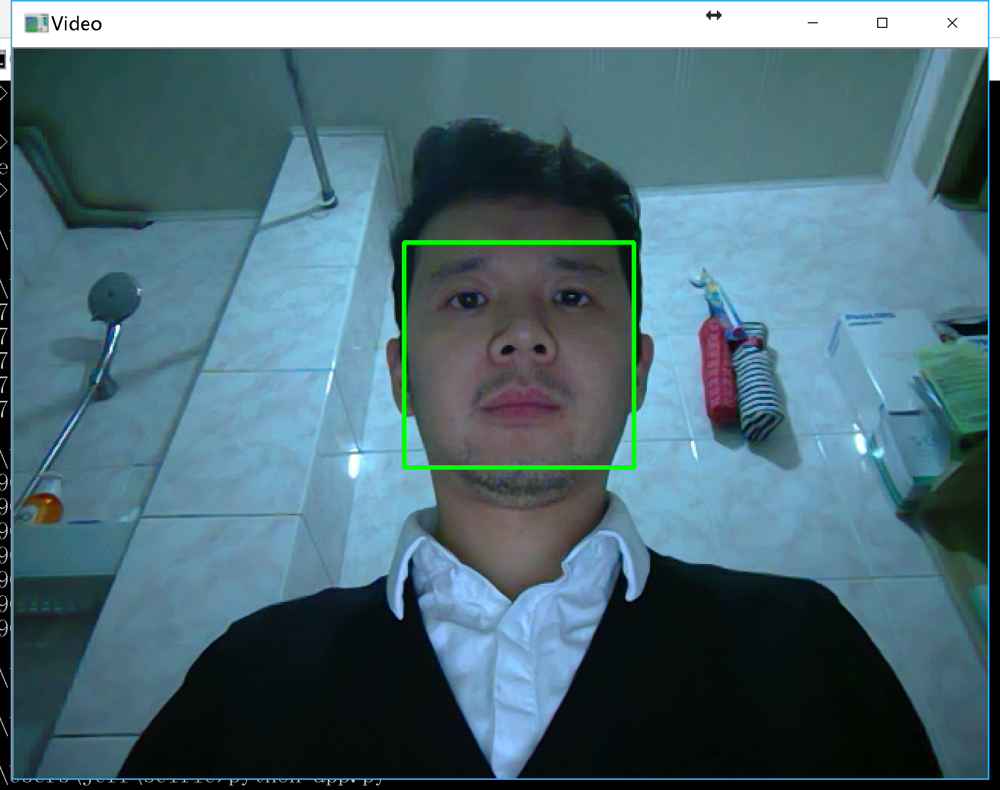

# selfie
可以双击运行的桌面程序，在自拍时给人脸添加酷酷的特效。
教学专用，你可以跟着代码提交历史，一步步实现很酷的功能

教学[PPT](自拍坊.pptx)

# 关键步骤
* 人脸识别并跟踪（仅需41行代码，效果如下）：


* 加特效 (TODO)

# 本地开发
```bash
git clone https://github.com/JeffTrain/selfie.git
cd selfie
pip install -r requirements.txt
```

# 本地运行
```bash
cd selfie
python app.py
```