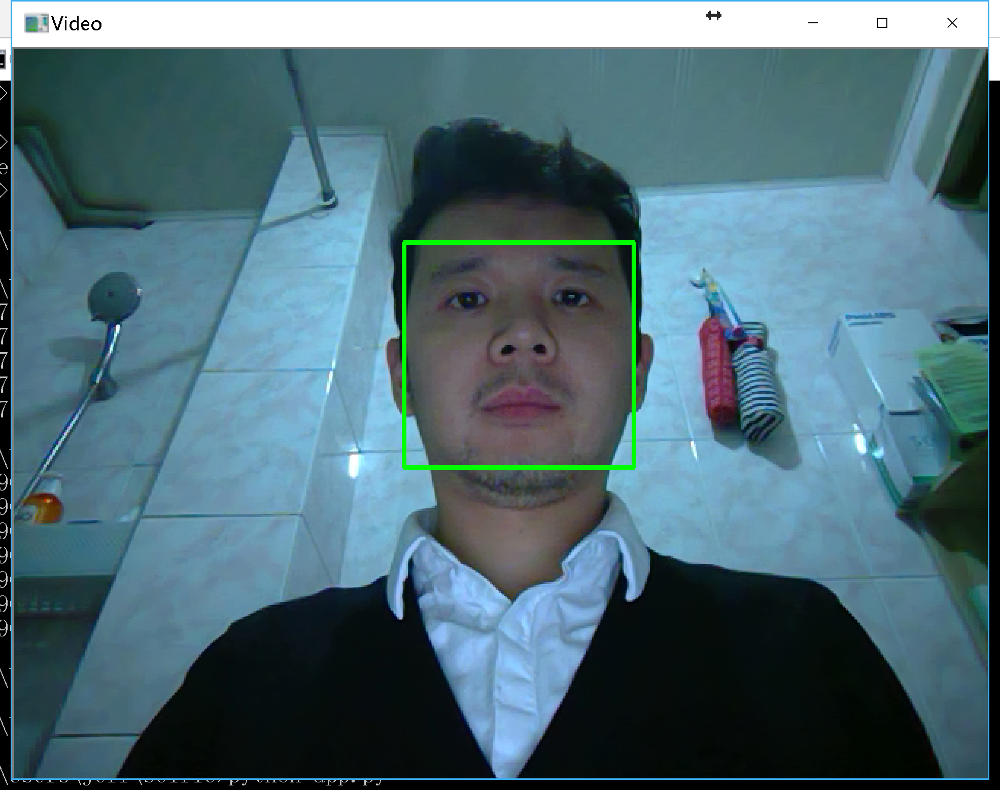
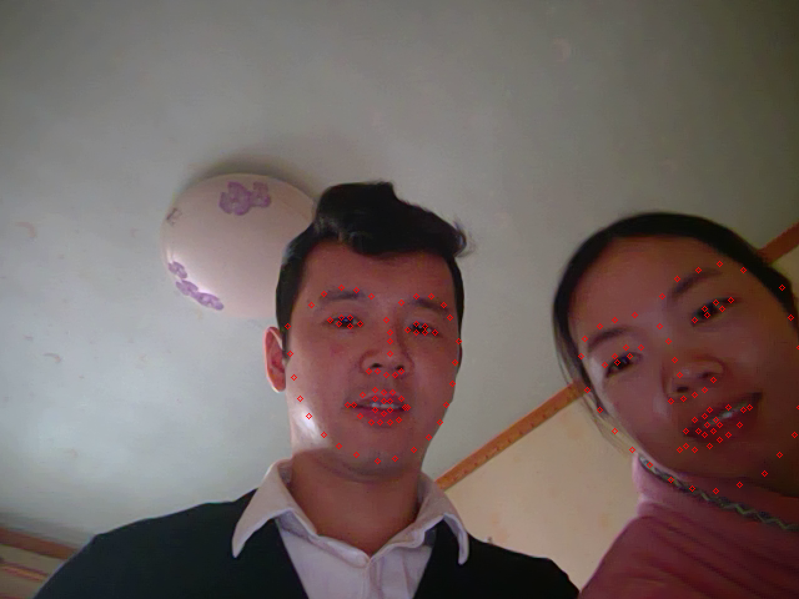
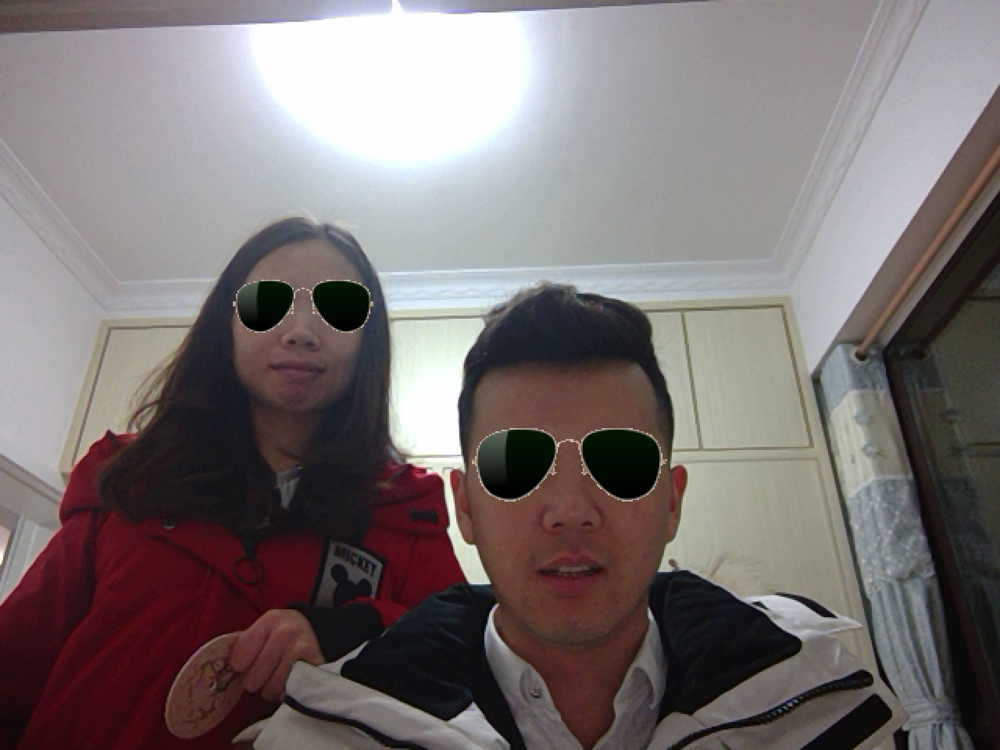

# selfie
可以双击运行的桌面程序，在自拍时给人脸添加酷酷的特效。
教学专用，你可以跟着代码提交历史，一步步实现很酷的功能

教学[PPT](自拍坊.pptx)

# 关键步骤
* 人脸识别并跟踪（仅需41行代码，效果如下）：


* 识别68个特征点


* 加特效


* LEGO 小人仔头部特效（按 L 键切换）
  - 识别人脸特征点后，将人物风格化为经典 LEGO 小人仔的黄色圆柱头部
  - 包含经典黑色圆点眼睛、弧形微笑和顶部凸点

# 按键操作
- `L` 键：切换为 LEGO 小人仔头部特效
- `S` 键：切换为墨镜特效
- `Q` 键：退出程序

# 本地开发
```bash
git clone https://github.com/JeffTrain/selfie.git
cd selfie
pyenv local 3.10.16
python -m pip install -r requirements.txt
python -m pip install pytest
```

# 本地运行
```bash
python app.py
```

# 运行测试
```bash
python -m pytest test_lego_head.py -v
```